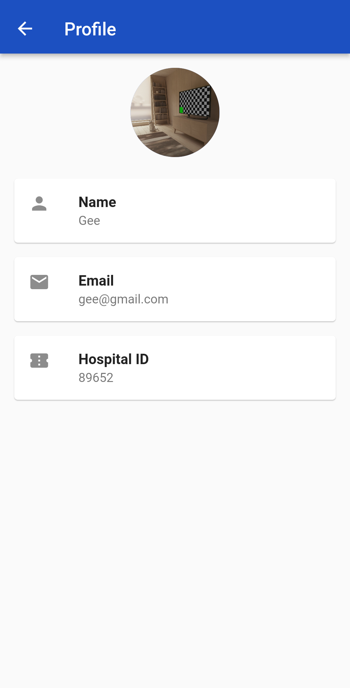
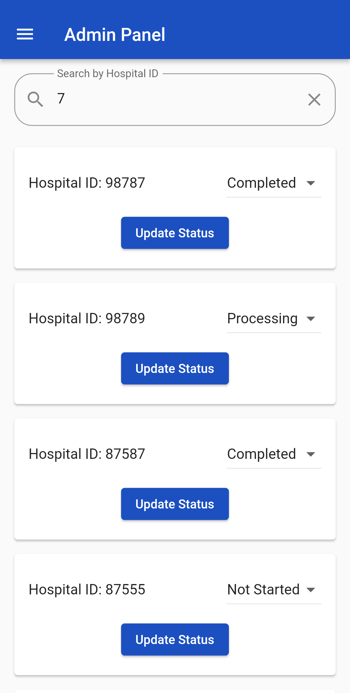

******KNUST Lab App******

The KNUST Lab App is a mobile application built using Flutter that allows users to manage laboratory processes, notifications, and user statuses. The app facilitates communication between users, administrators, and the laboratory staff, providing a streamlined experience for laboratory-related tasks.

**Features**
* **Profile Management:** Users can view and edit their profiles, including their avatar, name, email, and hospital ID.

* **Notification System:** Users receive notifications related to their status updates and other important information. Administrators can send notifications to users.

* **Admin Panel**: Administrators have access to an admin panel where they can manage user statuses and send notifications.

* Dashboard: The app provides a dashboard that displays important metrics, user statistics, and notifications at a glance.

****Screenshots****

  
  
  
  
  
  
  
  

****Installation****
1. Clone this repository to your local machine using:
   git clone https://github.com/bartonpratt/knust_lab.git

3. Navigate to the project directory:
   cd knust_lab_app
   
4. Install Flutter dependencies:
   flutter pub get

5. Make sure you have an Android or iOS emulator set up, or a physical device connected.
  
6. Run the app:
   flutter run

****Configuration****

**Firebase Setup:** To use the notification features, you need to set up Firebase Cloud Messaging (FCM) in your Firebase project and update the necessary configuration files. See the Firebase documentation for more details.

****Contributing****

Contributions are welcome! If you find a bug or want to add a new feature, please submit an issue or pull request.

****Acknowledgements****

Special thanks to God for how far He has brought us.
Also, a big thank you to our supervisor, Dr. Gaddaffi for guiding us throghout the process.
